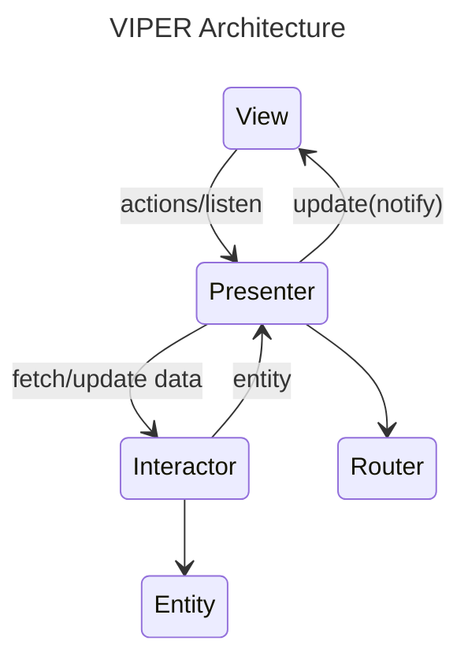

a simple Flutter app used [VIPER](https://medium.com/@pinarkocak/understanding-viper-pattern-619fa9a0b1f1) architecture.


## Purpose

Understand a VIPER architecture, separated by features.




- **V**iew
  - Shows data to user.
  - *View* only use the data from the *Presenter*.
  - User's action like tap or pressing the button calls *Presenter*'s method then handled by its *Presenter*.
- **I**nteractor
  - Handles the business logic and data fetching.
  - Convert the fetched data(Data Model Class) to *Entity*.
- **P**resenter
  - Handles user's action from *View*.
  - *Presenter* determines whether to call *Router*, or *Interactor*.
  - Manages the data flow and state management, updates the *View*, and delegates business logic to the *Interactor*.
- **E**ntity
  - Data used in *View*.
- **R**outer
  - Handles a navigation.
  - `BuildContext` is required for `Navigator`

### Implementation

Used `provider` to implement the *Presenter*.

Each *Presenter* of the features, extends `ChangeNotifier` and implements interface of *Presenter*.

The *View* can listen to the *Presenter* by adding a listener which shows data or error. And also *Presenter* will be able to send events when it receives result from *Interactor* or *Router*.

When linking the *View* and *Presenter* without any dependency injection like using `provider`, `riverpod` or etc, we might re-initialize the *Presenter*'s view with newly created instance of the *View*.

I'd not wanted to make *View* as nullable neither non-final. By making the *View* as `final` I ended up with using `provider` to fix this issue.

## Project Structure

``` plain
📦 lib
┣ 📂 ${feature_name}
┃ ┣ 📂 entity
┃ ┃ ┗ 📄 ${feature_name}.dart
┃ ┣ 📂 interactor
┃ ┃ ┗ 📄 ${feature_name}_interactor.dart
┃ ┣ 📂 presenter
┃ ┃ ┗ 📄 ${feature_name}_presenter.dart
┃ ┣ 📂 repository
┃ ┃ ┣ 📂 model
┃ ┃ ┃ ┗ 📄 ${feature_name}_model.dart
┃ ┃ ┗ 📄 ${feature_name}_repository.dart
┃ ┣ 📂 router
┃ ┃ ┗ 📄 ${feature_name}_router.dart
┃ ┣ 📂 view 
┃ ┃ ┗ 📄 ${feature_name}_screen.dart

... another features 

┣ 📄 main.dart
┣ 📄 util.dart
```

- `util.dart`: interface or extension which used on network (used `dio` package) and class for functionality.
- `main.dart`: where `runApp` located, feature's dependency injection has done in this area. (used `provider` package)

each feature has to implement all from `entity` to `view`.

every layer has interface to communicate between each layers.

> in *View*, skipped `displayData` due to `provider` provides `notifyListeners()` to handle changes.

## Screenshots 📷


## Nice to have

Create a *Builder* to take dependency injections and insert the Widgets to Widget Tree by each screens.
